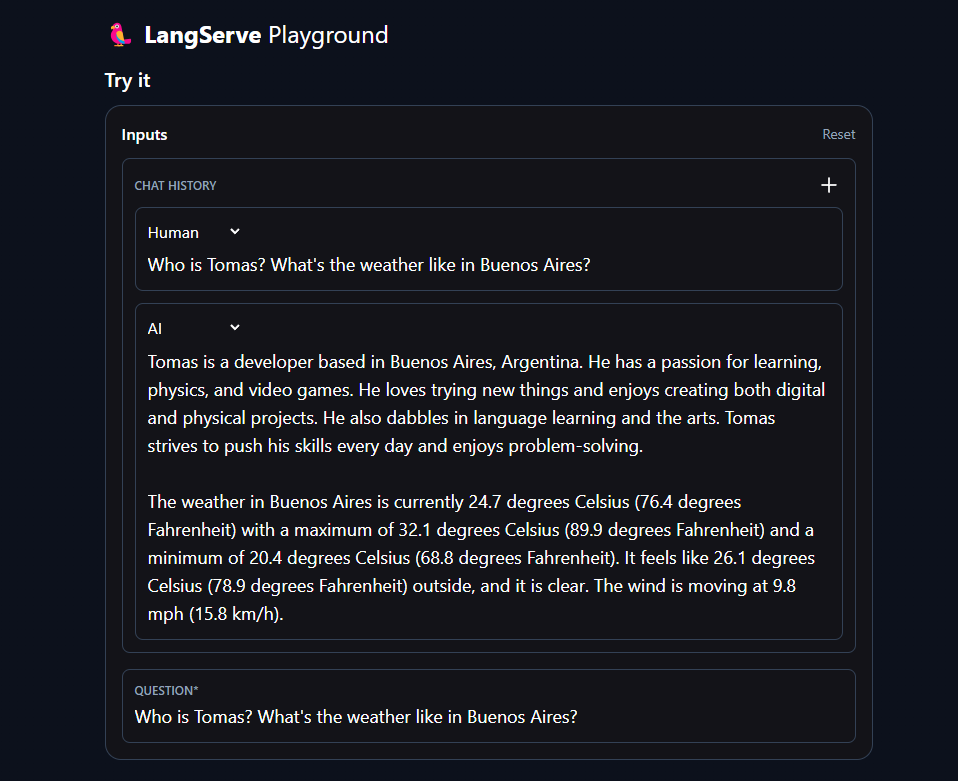
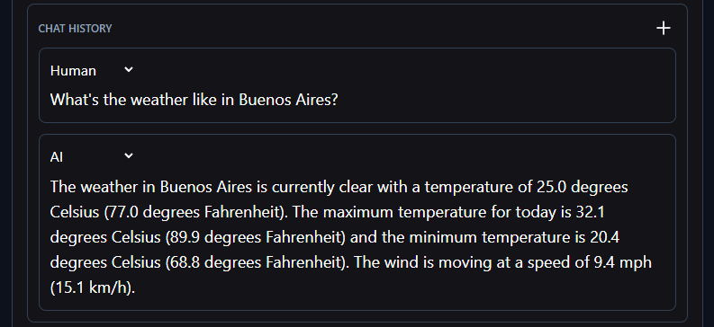
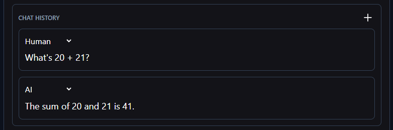
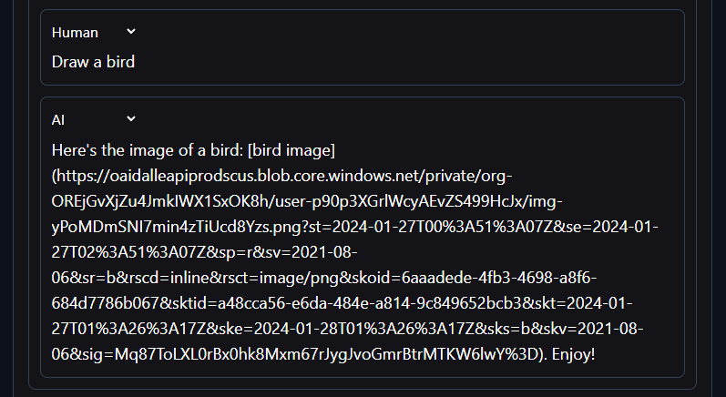

# AI Agents: Testing OpenAI Tools

First try at simple agent testing a bunch of OpenAI conforming tools.

## Deployed solution

If it stops responding, try refreshing the page. Handling issues.

[Playground demo, hosted on Fly.io](https://agent-functions-test.fly.dev/agent/playground/)




## How to run locally

First of all you need [Poetry](https://python-poetry.org/docs/#installation).

```
> pip install poetry
```

An account on [WeatherAPI](https://www.weatherapi.com/), for the weather tool.

And an [OpenAI API key](https://platform.openai.com/api-keys).

Clone the repo and:

```
> git clone https://github.com/tomasellis/agent_tools_test
> cd agent_tools_test
```

Make a .env including:

```
OPENAI_API_KEY=****
WEATHER_API_KEY=****
```

Then run the local server:

```
NPM
> npm run dev:python
```

```
PNPM
> pnpm dev:python
```

This will use Poetry to install python dependencies, and run the server using FastAPI and Uvicorn.

At http://127.0.0.1:8000/agent/playground.

## Stack and stuff

- Used Python, [Langchain, Langserve](https://python.langchain.com/docs/get_started/introduction), [FastAPI with Uvicorn](https://fastapi.tiangolo.com/), [OpenAI's API](https://platform.openai.com/api-keys) and [WeatherAPI's API](https://www.weatherapi.com/).
  - Was going to make a VITE web app but decided to scrap it and just work in the backend, using Langserve's Playground as UI. It's good enough for this.
  - ~~There's no error handling, it would be needed in a prod environment, but here is just me playing around. No need for that right now.~~
  - The team(me, i'm the team) had to handle errors, sometimes the agent would just not respond when using the external API tools like the Weather tool. The issue was a 400 response from the API that wasn't handled. So now we are proud error handlers. 🗿
- It's a chat, the message history is held in client. And is used by the agent too.
- The Agent can combine any of the tools together, as seen in the first picture. Mindblowing to be honest.

## On the Agent proper

The agent can do various things with the tools I wrote. They are pieces of code that are run by OpenAI's LLM.

You make an array with tools, which are either functions or classes with certain properties. They need a name, a description and the code proper.

Then you just make this, and give it to the agent.

```python
tools = [retriever_tool, weather, sum, draw]
```

## Kinda Web Scraper

You can ask it for info on me, Tomás. The agent has at hand the pages [About](https://tomasellis.dev/about) and [Projects](https://tomasellis.dev/projects). It's simple, my page is barebones with info, but it can answer simple questions on my person and some projects I made. It seems to think that I'm the best bot builder in the world.

Here's the implementation, it uses [FAISS](https://ai.meta.com/tools/faiss/) as the in memory vector indexer which we can query, and [OpenAI's embeddings](https://platform.openai.com/docs/guides/embeddings) to relate data.

Implementation:

```python
 loader = WebBaseLoader(["https://tomasellis.dev/about",...])
 docs = loader.load()
 text_splitter = RecursiveCharacterTextSplitter()
 documents = text_splitter.split_documents(docs)
 embeddings = OpenAIEmbeddings()
 vector = FAISS.from_documents(documents, embeddings)
 retriever = vector.as_retriever()
```

We can query with the retriever, but we make the tool for the agent.

```python
retriever_tool = create_retriever_tool(
    retriever,
    "tomas_info", <---- Tool name  \/ Tool description
    "Search for information about Tomas. For any questions about Tomas, you must use this tool!",
)
```

### Kinda Web Scraper: Example


## Weather Tool

This one uses an external API, [WeatherAPI's API](https://www.weatherapi.com/), to get data as a JSON of the weather in a city. Simple enough. I consume it, and give back some text to parse to the LLM. You can prompt it to only give you the results in certain units, like asking only for temperature in Celcius.

Implementation:

```python
@tool
async def weather(city: str) -> any: <-- Tool name
    """Get weather for a city"""     <-- Tool descrip.
    url = "***"
    response = requests.post(url)
    data = response.json()

    return """The weather is {data}"""
```

### Weather Tool: Example



## Sum Tool

Remnants of the start of the project, I wrote a simple function to sum 2 integers.

Implementation:

```python
@tool
def sum(int1: int, int2:int) -> int:
    """Sums two numbers and returns a number"""
    return int1 + int2
```

### Sum Tool: Example



## Draw Tool

This uses [OpenAI's Dall-E](https://openai.com/blog/dall-e-api-now-available-in-public-beta), it's prompted with some data and returns the url for an image.

```python

@tool
async def draw(image_desc: str) -> any:
    """Draws an image from a prompt and returns the image url"""

    llm = OpenAI(temperature=0.9)  <-- another individual model, to have some control

    prompt = PromptTemplate(
        input_variables=["image_desc"],

        template="Template prompt", <-- This uses the LLM to make a proper prompt, then uses the image_desc as the variable
    )

    chain = LLMChain(llm=llm, prompt=prompt)

    image_url = DallEAPIWrapper().run(chain.run(image_desc))

    return f"Here's the image url: {image_url} pass it fully to the user, don't cut it, leave the query params intact. Just pass the whole thing forward."  <--- This bit is pretty funny, the LLM was cutting the link and you could not access the image without the full query params. So I had to be a bit rough. Forgive me GPT.
```

## Draw Tool: Example



Here's the cursed bird.


## Observations

It's mindblowing what they have achieved. The agent chooses the tools on its own. And you can make as many as you want.

- ~~I have to handle error's still. Won't be doing it, but it's something to keep in mind.~~
- _Narrator: he did do it._
- The biggest issue I had was with Pydantic, which just tells you that it's working properly. As I coulnd't exactly get the hang of what Langchain was asking for. That's why there's a messager parsing function, to keep everything in line with what Langchain expects.
- Langchain's abstraction layer is amazing, you can just connect stuff and it works. I liked debugging looking at the agent's actions in the playground, and the playground is a great tool for developing.
