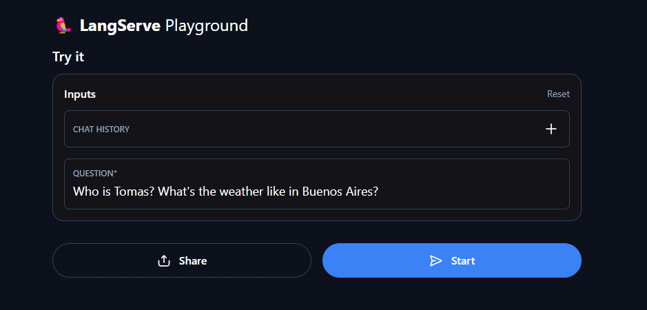

# AI Agents: Testing OpenAI Tools

A simple agent testing a bunch of OpenAI conforming tools.

## Deployed solution

[Playground demo, hosted on Fly.io](https://agent-functions-test.fly.dev/agent/playground/)




## How to run locally

First of all you need [Poetry](https://python-poetry.org/docs/#installation).

```
> pip install poetry
```

An account on [Free Weather API](https://www.weatherapi.com/), for the weather tool.

And an [OpenAI API key](https://platform.openai.com/api-keys).

Clone the repo and:

```
> git clone https://github.com/tomasellis/agent_tools_test
> cd agent_tools_test
```

Make a .env including:

```
OPENAI_API_KEY=****
WEATHER_API_KEY=****
```

Then run the local server:

```
NPM
> npm run dev:python
```

```
PNPM
> pnpm dev:python
```

This will use Poetry to install python dependencies, and run the server using FastAPI and Uvicorn.

At http://127.0.0.1:8000.
